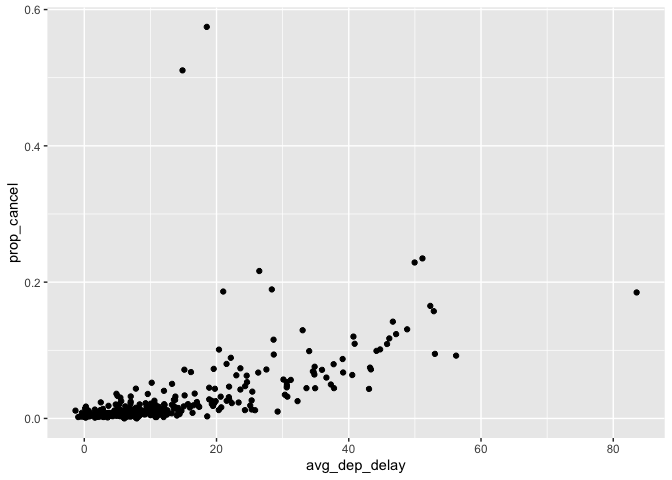

STAT433\_HW1
================

``` r
library(dplyr)
library(nycflights13)
library(ggplot2)
```

#### Question 1:

##### 1a). How many flights have a missing dep\_time?

``` r
#1a).
missing_dep_time <- flights %>%
  filter(is.na(dep_time))

cat(length(missing_dep_time$dep_time), "flights have a missing dep_time")
```

    ## 8255 flights have a missing dep_time

##### 1b). What other variables are missing?

The columns dep\_time, dep\_delay, arr\_time, and arr\_delay are also
all missing. Tailnum has some missing values.

``` r
#1b).
missing_dep_time %>%
  summarize(num_missing_dep_time = sum(is.na(dep_time)),
            num_missing_dep_delay = sum(is.na(dep_delay)),
            num_missing_arr_time = sum(is.na(arr_time)),
            num_missing_arr_delay = sum(is.na(arr_delay)),
            num_missing_tailnum = sum(is.na(tailnum)))
```

    ## # A tibble: 1 x 5
    ##   num_missing_dep… num_missing_dep… num_missing_arr… num_missing_arr…
    ##              <int>            <int>            <int>            <int>
    ## 1             8255             8255             8255             8255
    ## # … with 1 more variable: num_missing_tailnum <int>

##### 1c). What might these rows represent?

These rows might represent cancelled flights or flights that never
actually took of.

#### Question 2: Currently dep\_time and sched\_dep\_time are convenient to look at, but hard to compute with because they’re not really continuous numbers. Convert them to a more convenient representation of number of minutes since midnight.

``` r
#2).
minutes_since_midnight <- flights %>%
  select(dep_time, sched_dep_time) %>%
  mutate(hour_dep = dep_time %/% 100,
         minutes_dep = dep_time - (hour_dep * 100),
         minutes_since_dep = ((hour_dep*60)+minutes_dep) %% 1440,
         hour_sched = sched_dep_time %/% 100,
         minutes_sched = sched_dep_time - (hour_sched * 100),
         minutes_since_sched = ((hour_sched*60)+minutes_sched) %% 1440) %>%
  select(dep_time, minutes_since_dep, sched_dep_time, minutes_since_sched)

minutes_since_midnight
```

    ## # A tibble: 336,776 x 4
    ##    dep_time minutes_since_dep sched_dep_time minutes_since_sched
    ##       <int>             <dbl>          <int>               <dbl>
    ##  1      517               317            515                 315
    ##  2      533               333            529                 329
    ##  3      542               342            540                 340
    ##  4      544               344            545                 345
    ##  5      554               354            600                 360
    ##  6      554               354            558                 358
    ##  7      555               355            600                 360
    ##  8      557               357            600                 360
    ##  9      557               357            600                 360
    ## 10      558               358            600                 360
    ## # … with 336,766 more rows

#### Question 3:

##### 3a). Look at the number of cancelled flights per day. Is there a pattern?

``` r
# 3a).
delayed_count <- flights %>%
  mutate(cancelled = (is.na(dep_delay) | is.na(arr_delay))) %>%
  group_by(year, month, day) %>%
  summarize(count_cancel = sum(cancelled),
            count_total = n())

ggplot(delayed_count, aes(x=count_total, y=count_cancel)) +
         geom_point()
```

<!-- --> The pattern
is that the number of cancelled flights seems to increase as the total
number of flights increases.

##### 3b). Is the proportion of cancelled flights related to the average delay? Use multiple dyplr operations, all on one line, concluding with ggplot(aes(x= ,y=)) + geom\_point()

``` r
# 3b).
# DOING FOR BOTH ARRIVAL AND DEPARTURE AS IT IS NOT SPECIFIED:
# Departure
flights %>%
  mutate(cancelled = (is.na(dep_delay) | is.na(arr_delay))) %>%
  group_by(year, month, day) %>%
  summarize(prop_cancel = mean(cancelled),
            avg_dep_delay = mean(dep_delay, na.rm=TRUE)) %>%
  ggplot(aes(x=avg_dep_delay,y=prop_cancel)) + geom_point()
```

<!-- -->

``` r
# Arrival
flights %>%
  mutate(cancelled = (is.na(dep_delay) | is.na(arr_delay))) %>%
  group_by(year, month, day) %>%
  summarize(prop_cancel = mean(cancelled),
            avg_arr_delay = mean(arr_delay, na.rm=TRUE)) %>%
  ggplot(aes(x=avg_arr_delay,y=prop_cancel)) + geom_point()
```

<!-- -->
